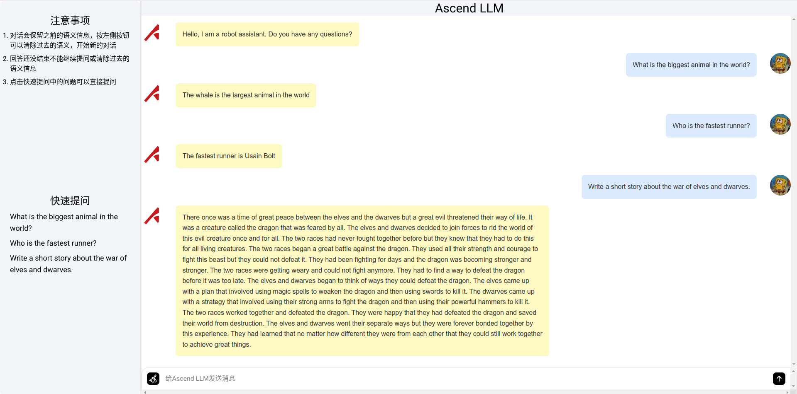

# ascend-llm-web

ascend-llm前端代码

## 效果图



## 运行与打包

请确保node.js版本大于等于v18.x，本项目开发为v20.12.2，node.js安装请参考[官方文档](https://github.com/nodesource/distributions/blob/master/README.md)

### 安装依赖

```shell
pnpm install #如没有安装pnpm，请使用npm install
```

### 测试运行

```shell
npm run dev
```

### 打包代码

```shell
npm run build
```

将打包后的dist文件夹放在ascend-llm/inference文件夹下。推理代码见[github](https://github.com/yinghuo302/ascend-llm)或[gitee](https://gitee.com/yinghuo302/ascend-llm-web)


